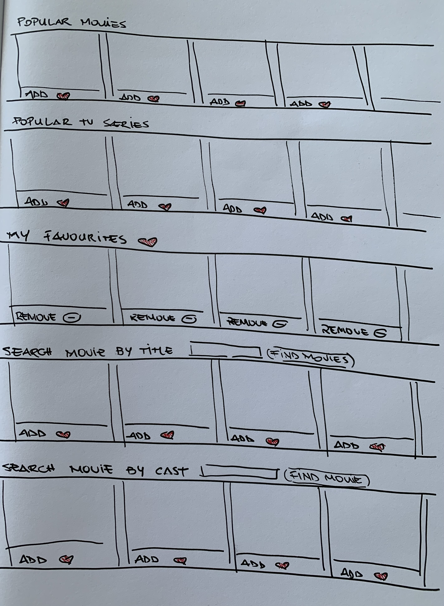

# popcornFlix - React App

## About

This is a React app inspired by Netflix where I had the opportunity to practice my react skills. I used TMDB API to fetch data with trending movies and tv shows. You can search a movie by title or cast. If you like the movie, you can save it in your list of favourites. If you change your mind, you can remove the movie from your list as well.

### [click here](https://popcornflix.surge.sh) to see my live project!

## Planning & Problem Solving

### Wireframe
    

This is the wireframe of my project. The idea was to have five rows. The first two will show the trending movies and the trending tv shows. In each card, you have a button where you can save the movie in your list of favourites. The row in the middle is the list of favourites, here you can delete any item you don't want in your list anymore. And the last two rows you can search for a movie by title and by cast and also save in your favourites list. 

### [click here](https://trello.com/b/JC4DGHs2/project-4-react-app) to see my Trello board!

## Technology used
- React
- Javascript 
- css
- html
- axios

## Lessons learnt

When you don't have much time to do a project, try to make it simple and to practice the foundation of the technology you're learning. That will help you learning more complex things in the future. Also trello board and wireframe help a lot.
 

## Future features 

- Add a carousel on the list instead of having an horizontal scroll bar 
- Add favourit list to local storage 
- add a link to spotify if the movie has a soundtrack 
- Create routes to add the description and other details of the movie in another page when you click on the movie poster
- Change the like button for a heart 
